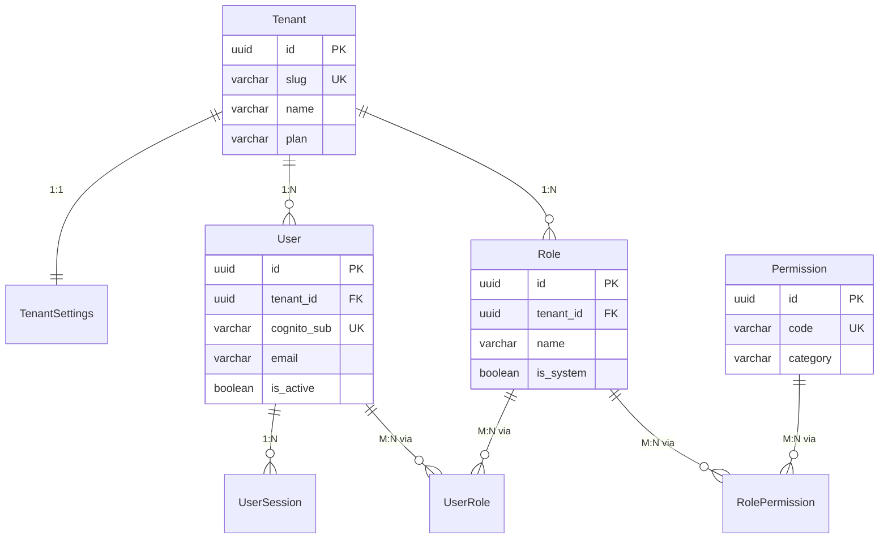
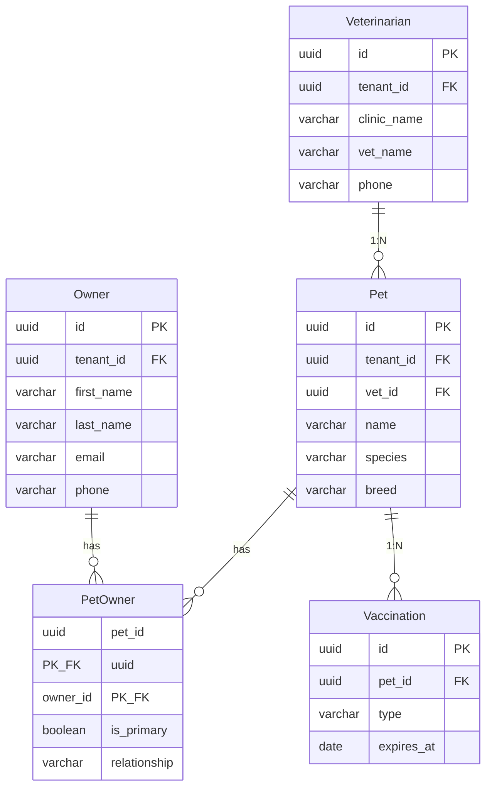
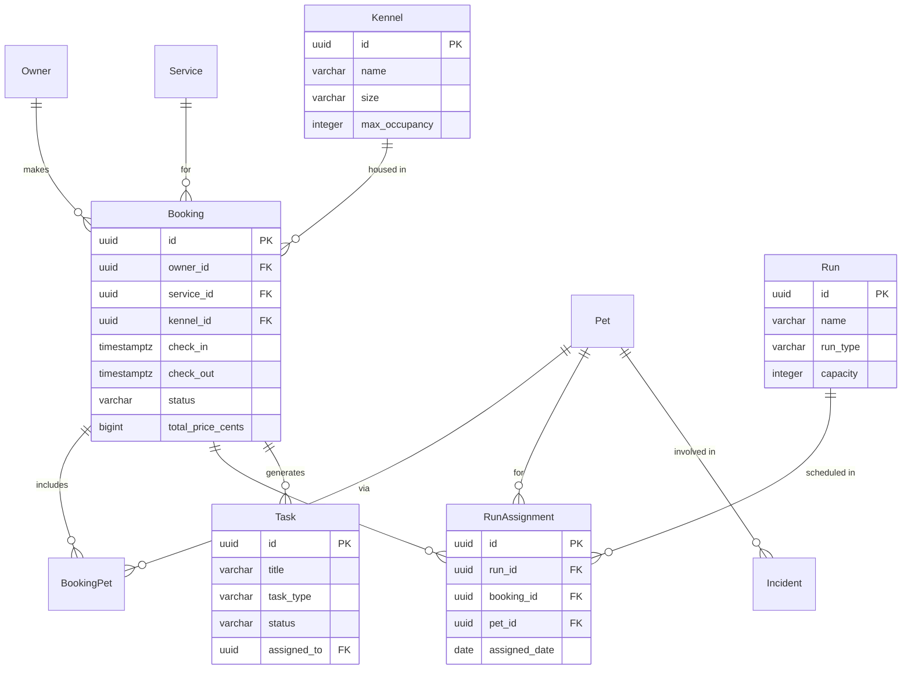
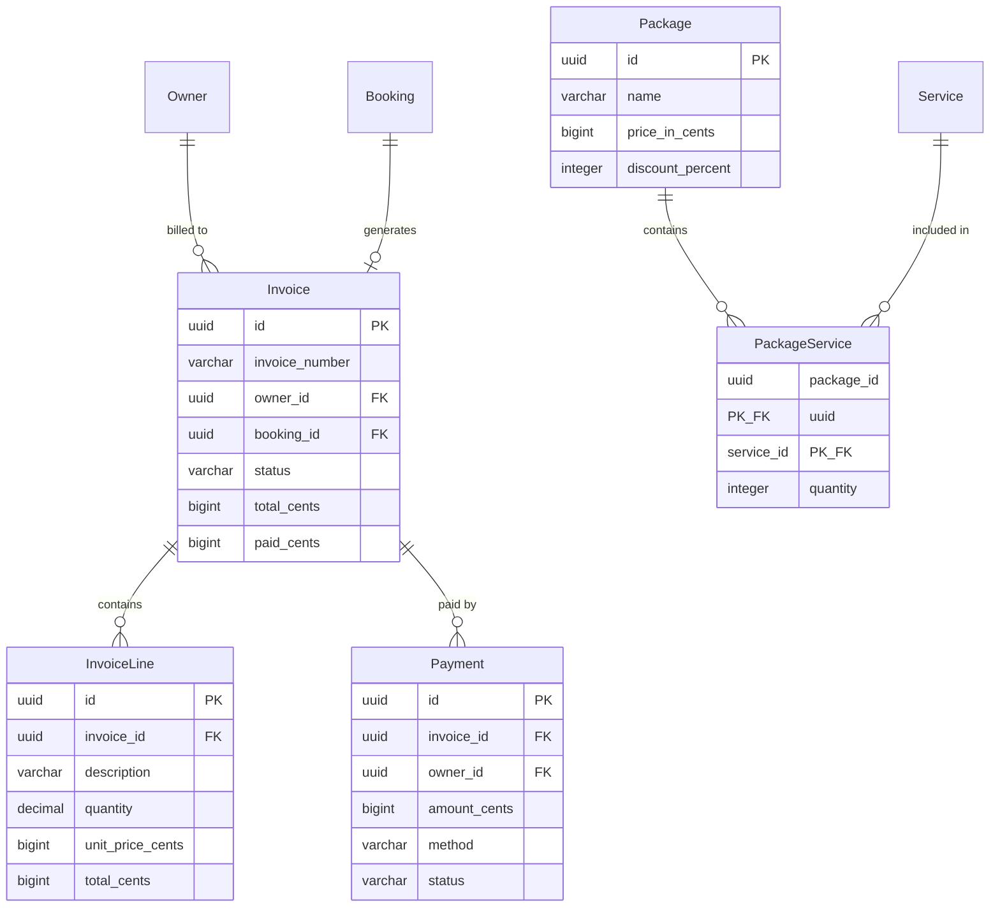

# Barkbase Database Schema - Entity Relationship Diagram

> **Generated:** 2025-12-06
> **Total Tables:** 32
> **Database:** PostgreSQL 15+

---

## Complete ERD Diagram

```mermaid
erDiagram
    %% ========================================
    %% CORE / AUTHENTICATION DOMAIN
    %% ========================================

    Tenant {
        uuid id PK
        varchar slug UK "URL-friendly identifier"
        varchar name "Business name"
        varchar plan "FREE, PRO, ENTERPRISE"
        jsonb feature_flags
        timestamptz created_at
        timestamptz updated_at
    }

    TenantSettings {
        uuid tenant_id PK,FK
        varchar timezone "IANA timezone"
        char currency "USD, EUR, GBP"
        varchar date_format
        varchar time_format
        varchar language
        varchar business_name
        varchar business_phone
        varchar business_email
        text business_address
        time default_check_in_time
        time default_check_out_time
        integer booking_buffer_minutes
        integer max_advance_booking_days
        integer min_advance_booking_hours
        boolean allow_online_booking
        boolean require_deposit
        integer deposit_percent
        boolean require_vaccinations
        integer cancellation_window_hours
        decimal tax_rate
        varchar tax_name
        varchar invoice_prefix
        text invoice_footer
        jsonb notification_prefs
        jsonb email_templates
        jsonb business_hours
        jsonb branding
        jsonb integrations
        jsonb custom_fields
        timestamptz created_at
        timestamptz updated_at
    }

    User {
        uuid id PK
        uuid tenant_id FK
        varchar cognito_sub UK "AWS Cognito ID"
        varchar email
        varchar first_name
        varchar last_name
        varchar phone
        text avatar_url
        boolean is_active
        timestamptz last_login_at
        timestamptz created_at
        timestamptz updated_at
    }

    UserSession {
        uuid id PK
        uuid user_id FK
        uuid tenant_id FK
        varchar session_token
        varchar ip_address
        text user_agent
        boolean is_active
        timestamptz session_start
        timestamptz last_activity
        timestamptz logged_out_at
    }

    Role {
        uuid id PK
        uuid tenant_id FK
        varchar name UK "Per tenant unique"
        text description
        boolean is_system "Cannot delete system roles"
        timestamptz created_at
        timestamptz updated_at
    }

    Permission {
        uuid id PK
        varchar code UK "booking.create, etc."
        varchar name
        text description
        varchar category "bookings, customers, etc."
    }

    RolePermission {
        uuid role_id PK,FK
        uuid permission_id PK,FK
    }

    UserRole {
        uuid user_id PK,FK
        uuid role_id PK,FK
        uuid tenant_id FK
        timestamptz assigned_at
        uuid assigned_by FK
    }

    %% ========================================
    %% CUSTOMER DOMAIN
    %% ========================================

    Owner {
        uuid id PK
        uuid tenant_id FK
        varchar first_name
        varchar last_name
        varchar email
        varchar phone
        varchar address_street
        varchar address_city
        varchar address_state
        varchar address_zip
        char address_country "2-letter code"
        varchar emergency_contact_name
        varchar emergency_contact_phone
        text notes
        text_array tags
        varchar stripe_customer_id
        boolean is_active
        timestamptz created_at
        timestamptz updated_at
        uuid created_by FK
        uuid updated_by FK
    }

    Veterinarian {
        uuid id PK
        uuid tenant_id FK
        varchar clinic_name
        varchar vet_name
        varchar phone
        varchar email
        varchar address_street
        varchar address_city
        varchar address_state
        varchar address_zip
        text notes
        boolean is_active
        timestamptz created_at
        timestamptz updated_at
    }

    Pet {
        uuid id PK
        uuid tenant_id FK
        uuid vet_id FK
        varchar name
        varchar species "DOG, CAT, OTHER"
        varchar breed
        varchar gender "MALE, FEMALE, UNKNOWN"
        varchar color
        decimal weight
        date date_of_birth
        varchar microchip_number
        text photo_url
        text medical_notes
        text dietary_notes
        text behavior_notes
        text_array behavior_flags
        varchar status "ACTIVE, INACTIVE, DECEASED"
        boolean is_active
        timestamptz created_at
        timestamptz updated_at
        uuid created_by FK
        uuid updated_by FK
    }

    PetOwner {
        uuid pet_id PK,FK
        uuid owner_id PK,FK
        uuid tenant_id FK
        boolean is_primary
        varchar relationship
        timestamptz created_at
    }

    Vaccination {
        uuid id PK
        uuid tenant_id FK
        uuid pet_id FK
        varchar type "Rabies, DHPP, etc."
        date administered_at
        date expires_at
        varchar provider
        varchar lot_number
        text document_url
        text notes
        timestamptz created_at
        timestamptz updated_at
        uuid created_by FK
    }

    %% ========================================
    %% OPERATIONS DOMAIN
    %% ========================================

    Service {
        uuid id PK
        uuid tenant_id FK
        varchar name
        text description
        varchar category "BOARDING, DAYCARE, etc."
        bigint price_in_cents
        integer duration_minutes
        boolean is_active
        integer sort_order
        timestamptz created_at
        timestamptz updated_at
    }

    Kennel {
        uuid id PK
        uuid tenant_id FK
        varchar name
        varchar size "SMALL, MEDIUM, LARGE, XLARGE"
        varchar location
        integer max_occupancy
        boolean is_active
        timestamptz created_at
        timestamptz updated_at
    }

    Run {
        uuid id PK
        uuid tenant_id FK
        varchar name
        text description
        integer capacity
        varchar run_type "SOCIAL, INDIVIDUAL, TRAINING"
        boolean is_active
        timestamptz created_at
        timestamptz updated_at
    }

    Booking {
        uuid id PK
        uuid tenant_id FK
        uuid owner_id FK
        uuid service_id FK
        uuid kennel_id FK
        timestamptz check_in
        timestamptz check_out
        varchar status "PENDING, CONFIRMED, etc."
        bigint total_price_cents
        bigint deposit_cents
        text notes
        text special_instructions
        timestamptz checked_in_at
        timestamptz checked_out_at
        uuid checked_in_by FK
        uuid checked_out_by FK
        timestamptz cancelled_at
        text cancellation_reason
        timestamptz created_at
        timestamptz updated_at
        uuid created_by FK
        uuid updated_by FK
    }

    BookingPet {
        uuid booking_id PK,FK
        uuid pet_id PK,FK
        uuid tenant_id FK
        timestamptz created_at
    }

    RunAssignment {
        uuid id PK
        uuid tenant_id FK
        uuid run_id FK
        uuid booking_id FK
        uuid pet_id FK
        date assigned_date
        time start_time
        time end_time
        boolean is_individual
        text notes
        timestamptz created_at
        uuid created_by FK
    }

    Task {
        uuid id PK
        uuid tenant_id FK
        varchar title
        text description
        varchar task_type "FEEDING, MEDICATION, etc."
        varchar status "PENDING, IN_PROGRESS, etc."
        integer priority "1-5"
        timestamptz due_at
        uuid assigned_to FK
        uuid booking_id FK
        uuid pet_id FK
        timestamptz completed_at
        uuid completed_by FK
        text notes
        timestamptz created_at
        timestamptz updated_at
        uuid created_by FK
    }

    Incident {
        uuid id PK
        uuid tenant_id FK
        varchar title
        text description
        varchar incident_type "INJURY, ILLNESS, etc."
        varchar severity "LOW, MEDIUM, HIGH, CRITICAL"
        varchar status "OPEN, INVESTIGATING, etc."
        timestamptz incident_date
        varchar location
        uuid pet_id FK
        uuid booking_id FK
        uuid reported_by FK
        text witnesses
        text immediate_actions
        boolean vet_contacted
        text medical_treatment
        text resolution_notes
        timestamptz resolved_at
        uuid resolved_by FK
        text_array attachments
        timestamptz created_at
        timestamptz updated_at
    }

    %% ========================================
    %% FINANCIAL DOMAIN
    %% ========================================

    Invoice {
        uuid id PK
        uuid tenant_id FK
        varchar invoice_number
        uuid owner_id FK
        uuid booking_id FK
        varchar status "DRAFT, SENT, PAID, etc."
        bigint subtotal_cents
        bigint tax_cents
        bigint discount_cents
        bigint total_cents
        bigint paid_cents
        date due_date
        timestamptz issued_at
        timestamptz paid_at
        text notes
        timestamptz created_at
        timestamptz updated_at
        uuid created_by FK
    }

    InvoiceLine {
        uuid id PK
        uuid tenant_id FK
        uuid invoice_id FK
        varchar description
        decimal quantity
        bigint unit_price_cents
        bigint total_cents
        boolean taxable
        integer sort_order
    }

    Payment {
        uuid id PK
        uuid tenant_id FK
        uuid invoice_id FK
        uuid owner_id FK
        bigint amount_cents
        varchar method "CARD, CASH, CHECK, etc."
        varchar status "PENDING, SUCCEEDED, etc."
        varchar stripe_payment_intent_id
        text notes
        timestamptz processed_at
        uuid processed_by FK
        timestamptz created_at
        timestamptz updated_at
    }

    Package {
        uuid id PK
        uuid tenant_id FK
        varchar name
        text description
        bigint price_in_cents
        integer discount_percent
        boolean is_active
        timestamptz created_at
        timestamptz updated_at
    }

    PackageService {
        uuid package_id PK,FK
        uuid service_id PK,FK
        integer quantity
    }

    %% ========================================
    %% COMMUNICATION DOMAIN
    %% ========================================

    Notification {
        uuid id PK
        uuid tenant_id FK
        uuid user_id FK
        varchar type
        varchar title
        text message
        boolean is_read
        timestamptz read_at
        varchar related_entity_type
        uuid related_entity_id
        timestamptz created_at
    }

    Note {
        uuid id PK
        uuid tenant_id FK
        varchar entity_type "owner, pet, booking"
        uuid entity_id
        text content
        varchar note_type "GENERAL, IMPORTANT, etc."
        boolean is_pinned
        timestamptz created_at
        timestamptz updated_at
        uuid created_by FK
    }

    %% ========================================
    %% CONFIGURATION DOMAIN
    %% ========================================

    EmailTemplate {
        uuid id PK
        uuid tenant_id FK
        varchar type
        varchar name
        varchar subject
        text body
        jsonb variables
        boolean is_active
        timestamptz created_at
        timestamptz updated_at
    }

    CustomProperty {
        uuid id PK
        uuid tenant_id FK
        varchar entity_type
        varchar field_name
        varchar display_label
        varchar field_type
        jsonb options
        boolean is_required
        text default_value
        integer sort_order
        boolean is_active
        timestamptz created_at
        timestamptz updated_at
    }

    %% ========================================
    %% AUDIT DOMAIN
    %% ========================================

    AuditLog {
        uuid id PK
        uuid tenant_id FK
        uuid user_id FK
        varchar action
        varchar entity_type
        uuid entity_id
        jsonb changes
        varchar ip_address
        text user_agent
        timestamptz created_at
    }

    DeletedRecord {
        uuid id PK
        uuid tenant_id FK
        varchar original_table
        uuid original_id
        jsonb data
        timestamptz deleted_at
        uuid deleted_by FK
    }

    %% ========================================
    %% RELATIONSHIPS
    %% ========================================

    %% Tenant relationships
    Tenant ||--|| TenantSettings : "has"
    Tenant ||--o{ User : "has"
    Tenant ||--o{ Role : "has"
    Tenant ||--o{ Owner : "has"
    Tenant ||--o{ Veterinarian : "has"
    Tenant ||--o{ Pet : "has"
    Tenant ||--o{ Service : "has"
    Tenant ||--o{ Kennel : "has"
    Tenant ||--o{ Run : "has"
    Tenant ||--o{ Booking : "has"
    Tenant ||--o{ Package : "has"
    Tenant ||--o{ Invoice : "has"
    Tenant ||--o{ Payment : "has"
    Tenant ||--o{ EmailTemplate : "has"
    Tenant ||--o{ CustomProperty : "has"
    Tenant ||--o{ AuditLog : "has"
    Tenant ||--o{ DeletedRecord : "has"

    %% User/Auth relationships
    User ||--o{ UserSession : "has"
    User ||--o{ UserRole : "has"
    Role ||--o{ UserRole : "assigned via"
    Role ||--o{ RolePermission : "has"
    Permission ||--o{ RolePermission : "assigned via"

    %% Customer relationships
    Pet ||--o{ PetOwner : "linked via"
    Owner ||--o{ PetOwner : "linked via"
    Veterinarian ||--o{ Pet : "cares for"
    Pet ||--o{ Vaccination : "has"

    %% Booking relationships
    Owner ||--o{ Booking : "makes"
    Service ||--o{ Booking : "booked for"
    Kennel ||--o{ Booking : "housed in"
    Booking ||--o{ BookingPet : "includes"
    Pet ||--o{ BookingPet : "booked via"

    %% Run/Exercise relationships
    Run ||--o{ RunAssignment : "scheduled in"
    Booking ||--o{ RunAssignment : "has"
    Pet ||--o{ RunAssignment : "assigned to"

    %% Task/Incident relationships
    Booking ||--o{ Task : "generates"
    Pet ||--o{ Task : "related to"
    User ||--o{ Task : "assigned to"
    Booking ||--o{ Incident : "has"
    Pet ||--o{ Incident : "involved in"
    User ||--o{ Incident : "reported by"

    %% Financial relationships
    Owner ||--o{ Invoice : "billed to"
    Booking ||--o| Invoice : "generates"
    Invoice ||--o{ InvoiceLine : "contains"
    Invoice ||--o{ Payment : "paid by"
    Owner ||--o{ Payment : "makes"

    %% Package relationships
    Package ||--o{ PackageService : "contains"
    Service ||--o{ PackageService : "included in"

    %% Notification relationships
    User ||--o{ Notification : "receives"
```



---

## Domain-Specific ERD Views

### 1. Core/Authentication Domain



### 2. Customer Domain



### 3. Operations Domain



### 4. Financial Domain



---

## Table Summary by Domain

### Core/Auth (7 tables)
| Table | Type | RLS | Description |
|-------|------|-----|-------------|
| Tenant | Root | No | Multi-tenant root |
| TenantSettings | Config | Yes | All settings consolidated |
| User | Entity | Yes | Staff/admin accounts |
| UserSession | Entity | Yes | Active sessions |
| Role | Entity | Yes | Role definitions |
| Permission | Lookup | No | Global permissions |
| RolePermission | Junction | Via Role | Role-Permission mapping |
| UserRole | Junction | Yes | User-Role assignment |

### Customers (5 tables)
| Table | Type | RLS | Description |
|-------|------|-----|-------------|
| Owner | Entity | Yes | Pet parents/customers |
| Veterinarian | Entity | Yes | Vet clinics |
| Pet | Entity | Yes | Animals |
| PetOwner | Junction | Yes | Pet-Owner relationship |
| Vaccination | Entity | Yes | Vaccination records |

### Operations (8 tables)
| Table | Type | RLS | Description |
|-------|------|-----|-------------|
| Service | Entity | Yes | Service offerings |
| Kennel | Entity | Yes | Housing units |
| Run | Entity | Yes | Exercise/play areas |
| Booking | Entity | Yes | Reservations |
| BookingPet | Junction | Yes | Booking-Pet mapping |
| RunAssignment | Entity | Yes | Pet run schedules |
| Task | Entity | Yes | Staff tasks |
| Incident | Entity | Yes | Safety incidents |

### Financial (5 tables)
| Table | Type | RLS | Description |
|-------|------|-----|-------------|
| Invoice | Entity | Yes | Customer bills |
| InvoiceLine | Entity | Yes | Invoice line items |
| Payment | Entity | Yes | Payment records |
| Package | Entity | Yes | Service bundles |
| PackageService | Junction | Via Package | Package-Service mapping |

### Communication (2 tables)
| Table | Type | RLS | Description |
|-------|------|-----|-------------|
| Notification | Entity | Yes | In-app notifications |
| Note | Entity | Yes | Internal notes (polymorphic) |

### Configuration (2 tables)
| Table | Type | RLS | Description |
|-------|------|-----|-------------|
| EmailTemplate | Entity | Yes | Email templates |
| CustomProperty | Entity | Yes | Custom field definitions |

### Audit (2 tables)
| Table | Type | RLS | Description |
|-------|------|-----|-------------|
| AuditLog | Append-only | Yes | Change tracking |
| DeletedRecord | Archive | Yes | Soft delete archive |

---

## Junction Tables Detail

| Junction | Left | Right | PK | Extra Columns |
|----------|------|-------|-----|---------------|
| PetOwner | Pet | Owner | (pet_id, owner_id) | is_primary, relationship |
| BookingPet | Booking | Pet | (booking_id, pet_id) | created_at |
| RolePermission | Role | Permission | (role_id, permission_id) | - |
| UserRole | User | Role | (user_id, role_id) | assigned_at, assigned_by |
| PackageService | Package | Service | (package_id, service_id) | quantity |

**Note:** RunAssignment is NOT a pure junction table - it has its own PK (id) and contains scheduling data (date, times), so it's classified as an entity.

---

## Index Strategy Summary

All indexes follow the pattern: `idx_{table}_{columns}`

### Composite Indexes (tenant_id LEADING)
```
idx_user_tenant_email        (tenant_id, email)
idx_owner_tenant_name        (tenant_id, last_name, first_name)
idx_owner_tenant_email       (tenant_id, email)
idx_pet_tenant_name          (tenant_id, name)
idx_pet_tenant_species       (tenant_id, species)
idx_booking_tenant_checkin   (tenant_id, check_in)
idx_booking_tenant_status    (tenant_id, status)
idx_task_tenant_due          (tenant_id, due_at)
idx_task_tenant_status       (tenant_id, status)
idx_invoice_tenant_date      (tenant_id, created_at)
idx_invoice_tenant_status    (tenant_id, status)
idx_runassignment_tenant_date (tenant_id, assigned_date)
```

### Foreign Key Indexes
```
idx_pet_vet                  (vet_id)
idx_booking_kennel           (kennel_id)
idx_booking_owner            (owner_id)
idx_task_assigned            (assigned_to)
idx_invoiceline_invoice      (invoice_id)
idx_payment_invoice          (invoice_id)
idx_payment_owner            (owner_id)
```

### Partial Indexes
```
idx_usersession_active       (tenant_id, is_active) WHERE is_active = true
idx_service_tenant_active    (tenant_id, is_active) WHERE is_active = true
idx_kennel_tenant_active     (tenant_id, is_active) WHERE is_active = true
idx_notification_unread      (tenant_id, user_id, is_read) WHERE is_read = false
idx_package_tenant_active    (tenant_id, is_active) WHERE is_active = true
```

---

## RLS Policy Summary

All tenant-scoped tables use the same policy:

```sql
ALTER TABLE "TableName" ENABLE ROW LEVEL SECURITY;

CREATE POLICY tenant_isolation ON "TableName"
  FOR ALL
  USING (tenant_id = current_setting('app.current_tenant_id')::uuid);
```

**Tables WITHOUT RLS:**
- `Tenant` - Root table
- `Permission` - Global lookup table

**Tables with RLS via parent:**
- `RolePermission` - Via Role's tenant_id
- `PackageService` - Via Package's tenant_id

---

## Key Design Patterns

### 1. Multi-Tenant Isolation
- Every tenant-scoped table has `tenant_id UUID NOT NULL`
- RLS policies enforce row-level security
- All composite indexes lead with `tenant_id`

### 2. Soft Delete via Archive
- No `deleted_at` columns on entity tables
- Deleted records moved to `DeletedRecord` table with full JSON snapshot
- Simplifies queries (no `WHERE deleted_at IS NULL`)

### 3. Audit Trail
- `created_at`, `updated_at` on all tables
- `created_by`, `updated_by` on user-modifiable tables
- `AuditLog` table for detailed change tracking

### 4. Money in Cents
- All monetary values stored as `BIGINT` in cents
- Column suffix: `_cents` (e.g., `price_in_cents`, `amount_cents`)
- No floating-point arithmetic issues

### 5. Timestamps with Timezone
- All timestamps use `TIMESTAMPTZ`
- Never `TIMESTAMP` without timezone
- Consistent UTC storage, client-side conversion

### 6. UUID Primary Keys
- All primary keys are `UUID DEFAULT gen_random_uuid()`
- No sequential integer IDs (security + distribution)
- Foreign keys match parent type

### 7. Proper RBAC
- Roles are tenant-specific
- Permissions are global (system-defined)
- Many-to-many via junction tables
- No role ENUM on User table
